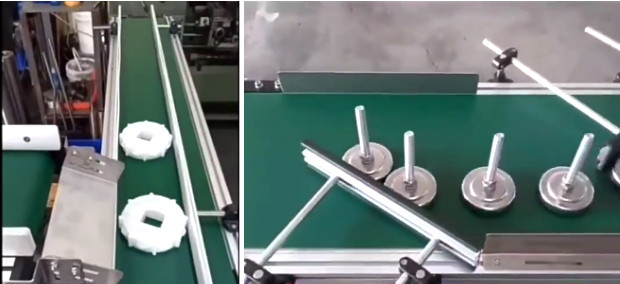
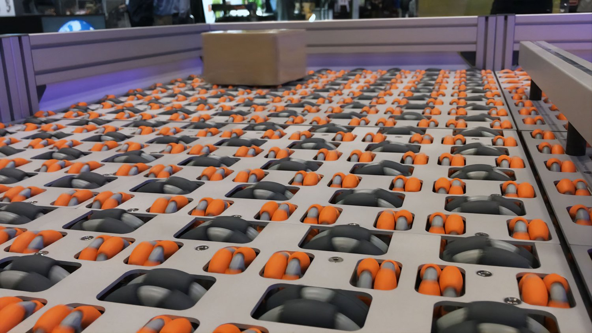

# feat 1
## 1.1 จำแนก ESPCAM

## 1.2 ส่ง ขยะ
- 1.2.1 ลำเลียง use สายพาน position
- 1.2.2 แยก 
    - block way selector
     
    

    - omni selector 
    [link ref](https://www.design-industry.com.au/omnia-sortation-systems)
     
    

# feat 2
## 2.1 ลดการใช้พื้นขยะในถัง
- บีบ -> ทางเลือก
- สั่น -> ติดอยู่กับถัง

# แยกอะไรบ้าง
- ขยะทั่วไป (General waste)
- ขยะรีไซเคิล (Recyclable waste)
- ขยะย่อยสลาย (Compostable waste)
- unknown